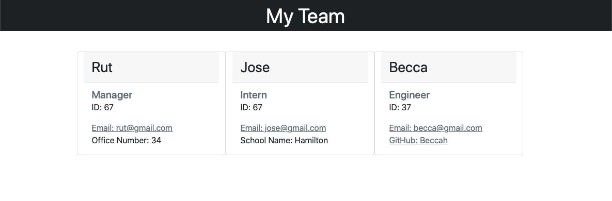

# Team Profile Generator

# Description
Generates an HTML webpage that displays summaries of each employee. User answers questions in the command-line to insert new employees. Once the user is done inputting employees, they can choose "Exit" as an option and a HTML file will be created.

Link to walkthrough video: https://drive.google.com/file/d/1JYIlIEpK5k_YgOP5JNMowAC87wwokT4L/view
# Build With:
* JavaScript

# Installation
Clone the repository then run "npm i", "npm i inquirer", and finally "node index" to start the app in the command-line.

# Tests
Run "npm run test" in the command-line.

# Created by:
Rebecca Hurtado
